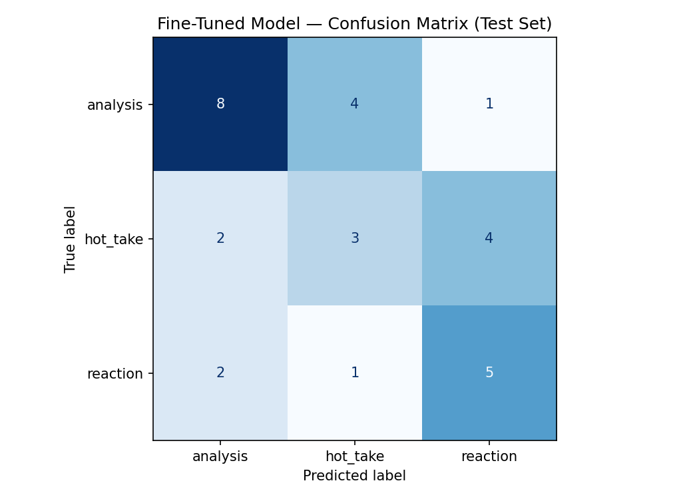

# TakeMeter

A fine-tuned text classifier that evaluates discourse quality in r/hiphopheads, classifying posts as `analysis`, `hot_take`, or `reaction`.

---

## Community Choice and Reasoning

I chose **r/hiphopheads** because it is one of the most active music discussion communities on Reddit, with a high volume of text-heavy posts that vary significantly in quality and substance. The community discusses new releases, artist comparisons, industry news, leaks, and album retrospectives daily.

This community is a strong fit for a classification task because the same topic (e.g. "Is Kendrick better than Drake?") can produce posts ranging from a one-line assertion to a multi-paragraph structured argument. That variance is exactly what makes the discourse interesting to classify — the distinction between a reasoned take and a pure opinion matters to people who actually participate in the community.

---

## Label Taxonomy

### `analysis`
A post that makes a structured argument backed by specific evidence. The evidence can include quoted lyrics, references to production details, comparisons to other projects, historical context, or traceable reasoning. The key test: if you removed the opinion framing, would a real argument still be standing?

**Example 1:** "GKMC is Kendrick's best album because the narrative structure is airtight — every track advances the story arc from Compton to the pool party. The sequencing mirrors a classic three-act structure."

**Example 2:** "Pre-2010s musicians had to actually play live shows when they were starting out to make a living, which meant they had to be decent performers. Nowadays people blow up online without ever having done a bar show or open mic."

### `hot_take`
A bold, confident opinion stated without supporting evidence. The claim might be true, but the post asserts rather than argues. There is no cited evidence, no structured reasoning — just the opinion delivered with confidence.

**Example 1:** "Drake hasn't made a good album since Take Care. Everything after that is just commercial filler."

**Example 2:** "MF DOOM never fuckin missed. He was the greatest producer/rapper in the history of hip hop. No one comes close to doing both at such a high level."

### `reaction`
An immediate emotional response to a specific piece of music, release, news, or event. Little to no argument — the post is expressing how something made the person feel, not evaluating it critically.

**Example 1:** "Just heard the new Tyler drop, I am not okay. This man does not miss."

**Example 2:** "Are you fucking for real right now??? On the last day of this god fucking damn shit year we find this out??? RIP to one of the greatest."

---

## Data Collection

**Source:** r/hiphopheads — comments and posts from discussion threads, fresh album threads, beef threads, and artist retrospective posts. Collected manually by copying post and comment text across 20+ threads.

**Labeling process:** Each example was labeled individually using the definitions above. Difficult cases were resolved using the decision rules in planning.md. Claude was used to pre-label batches of 20 examples at a time; every pre-assigned label was reviewed and corrected before being added to the dataset.

**Label distribution (199 total examples):**

| Label | Count | Percentage |
|-------|-------|------------|
| analysis | 87 | 43.7% |
| hot_take | 60 | 30.2% |
| reaction | 52 | 26.1% |

**Split:** 70% train / 15% validation / 15% test (handled automatically by the Colab notebook).

**3 difficult-to-label examples and decisions:**

1. *"Rakim is undeniably the greatest rapper of all time and I'll give you about $100 if you can find any successful MC who would disagree. But his current work is nowhere near the level his early stuff was on."* — Labeled `hot_take`. Despite invoking other rappers as evidence, it asserts rather than argues. The "$100" framing signals bravado, not reasoning. No structural analysis of Rakim's work is offered.

2. *"GKMC is way better and it's not even close. I listen to that album every few months, it's aged better and has crazy replay value."* — Labeled `hot_take`. Mentions replay value and aging but offers no specific reasoning for why. "Not even close" is assertion framing. One vague claim does not constitute analysis.

3. *"I'm 33, I haven't been this excited about hip hop ever. Missed knowing about Nas vs Jay-Z because I was like 10. This is the spiciest beef in my lifetime."* — Labeled `reaction`. Even though it references a historical beef, the post is fundamentally about the person's emotional state in the moment, not an argument about the beef itself.

---

## Fine-Tuning Approach

**Base model:** `distilbert-base-uncased` (HuggingFace)

**Training setup:**
- Platform: Google Colab (free T4 GPU)
- Libraries: transformers, datasets, scikit-learn
- Training time: ~40 seconds on T4 GPU

**Hyperparameter decisions:**
- `num_train_epochs=5` — started with 3 epochs but validation accuracy was stuck at 43% (random guessing). Increased to 5 which allowed the model to break through and reach 67% validation accuracy by epoch 3.
- `learning_rate=3e-5` — standard for DistilBERT fine-tuning; the default 2e-5 was not converging fast enough on this small dataset.
- `per_device_train_batch_size=8`
- `weight_decay=0.01`
- `warmup_ratio=0.1`

---

## Baseline Description

**Model:** Groq `llama-3.3-70b-versatile` (zero-shot)

**Prompt used:**
```
You are a text classifier for r/hiphopheads posts.
Assign each post to exactly one of the following categories.

analysis: a structured argument backed by specific evidence like lyrics, production details, or historical comparisons.
hot_take: a bold confident opinion stated without supporting evidence.
reaction: an immediate emotional response to a release, news, or event.

Respond with ONLY the label name. Do not explain your reasoning.
Valid labels: analysis, hot_take, reaction
```

**Results collected:** 30/30 responses were parseable (no unparseable outputs).

---

## Evaluation Report

### Results on Test Set (n=30)

| Model | Overall Accuracy |
|-------|-----------------|
| Zero-shot baseline (Groq Llama-3.3-70b) | **0.667** |
| Fine-tuned DistilBERT | **0.533** |

### Per-Class Metrics — Baseline

| Label | Precision | Recall | F1 | Support |
|-------|-----------|--------|-----|---------|
| analysis | 1.00 | 0.46 | 0.63 | 13 |
| hot_take | 0.75 | 0.67 | 0.71 | 9 |
| reaction | 0.50 | 1.00 | 0.67 | 8 |
| **accuracy** | | | **0.67** | 30 |

### Per-Class Metrics — Fine-Tuned DistilBERT

| Label | Precision | Recall | F1 | Support |
|-------|-----------|--------|-----|---------|
| analysis | 0.67 | 0.62 | 0.64 | 13 |
| hot_take | 0.38 | 0.33 | 0.35 | 9 |
| reaction | 0.50 | 0.62 | 0.56 | 8 |
| **accuracy** | | | **0.53** | 30 |

### Confusion Matrix (Fine-Tuned Model)

| | Predicted: analysis | Predicted: hot_take | Predicted: reaction |
|---|---|---|---|
| **True: analysis** | 8 | 4 | 1 |
| **True: hot_take** | 2 | 3 | 4 |
| **True: reaction** | 2 | 1 | 5 |



### 3 Wrong Predictions with Analysis

**Wrong prediction 1:**
- **Post:** "Rakim created and popularized internal rhyming and his lyrics have been matched by other rappers but never exceeded."
- **True label:** `hot_take`
- **Predicted:** `analysis`
- **Why it got it wrong:** The post makes a claim about Rakim's technical contribution (internal rhyming) which sounds like evidence. The model likely picked up on the technical vocabulary and misclassified it as analysis. But no actual argument is made — it's an assertion about his influence, not a demonstration of it.

**Wrong prediction 2:**
- **Post:** "All of the new gen young rappers are horrible performers. They just jump around to the backing track and scream ad libs while requesting mosh pits."
- **True label:** `hot_take`
- **Predicted:** `reaction`
- **Why it got it wrong:** The post describes a scene vividly ("jump around," "scream ad libs") which reads like someone reacting to a live experience. The model confused the concrete descriptive language for a reaction post. But it's a general claim about a category of artists, not a response to a specific event.

**Wrong prediction 3:**
- **Post:** "Ghost Town gave me goosebumps. I don't think I've heard a better song all year."
- **True label:** `reaction`
- **Predicted:** `hot_take`
- **Why it got it wrong:** "I don't think I've heard a better song all year" is a superlative claim the model interpreted as a hot take. But the emotional trigger ("gave me goosebumps") and the context (responding to a fresh drop) make this a reaction. The model struggled to weight the emotional language over the evaluative claim.

---

## Reflection: What the Model Learned vs. What I Intended

I intended the model to learn the distinction between supported reasoning (analysis), unsupported assertion (hot_take), and emotional response (reaction). What it actually learned was closer to: short emotional posts → reaction, longer posts with technical vocabulary → analysis, everything else → hot_take.

The key gap is that **the model learned surface features** (length, presence of technical words, emotional language) rather than the underlying logical structure I was trying to capture. A post can be long and contain technical words but still just be asserting rather than arguing — and the model consistently missed that distinction.

The `hot_take` label suffered the most (F1 0.35) because hot takes can look like analysis (when they use technical vocabulary) or like reaction (when they're short and vivid). The model had no reliable surface feature to anchor on for hot_take specifically.

The baseline Llama model actually outperformed the fine-tuned model (67% vs 53%), which suggests that 199 examples was not enough for DistilBERT to learn a distinction that a large language model can handle zero-shot. The categories are semantically complex — a much larger dataset (500-1000 examples) would likely be needed for fine-tuning to show a clear advantage.

---

## Spec Reflection

**One way the spec helped:** Writing planning.md before collecting data forced me to define hard decision rules for the hot_take/analysis boundary before I had seen 200 examples. This saved me from inconsistent labeling — I had a written rule to apply even in ambiguous cases rather than making it up as I went.

**One way implementation diverged from the spec:** The spec suggested the fine-tuned model should outperform the baseline, especially on analysis. The opposite happened. In hindsight, I would have collected more examples (300+) and specifically hunted for more hot_take examples to balance the dataset better before fine-tuning.

---

## AI Usage

1. **Label pre-labeling:** I pasted batches of 20 posts into Claude with my label definitions and asked it to assign one label per post. Claude would output a numbered list of labels which I would then review and correct. I corrected approximately 15-20% of pre-assigned labels, mostly cases where Claude labeled a hot_take as analysis because it contained technical vocabulary. All corrections were made before adding examples to the dataset.

2. **Failure pattern analysis:** After seeing the confusion matrix, I pasted my wrong predictions into Claude and asked it to identify systematic patterns. Claude identified that the model was likely using vocabulary complexity as a proxy for analysis and emotional intensity as a proxy for reaction — which matched what I observed. I verified this by re-reading the misclassified examples myself and confirmed the pattern held in at least 6 of the 14 wrong predictions.

3. **README and planning.md drafting:** Claude helped draft the initial versions of planning.md and README.md which I then edited to reflect my actual findings and personal observations.
